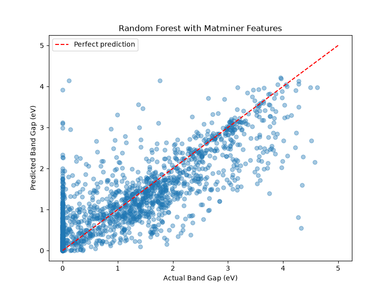
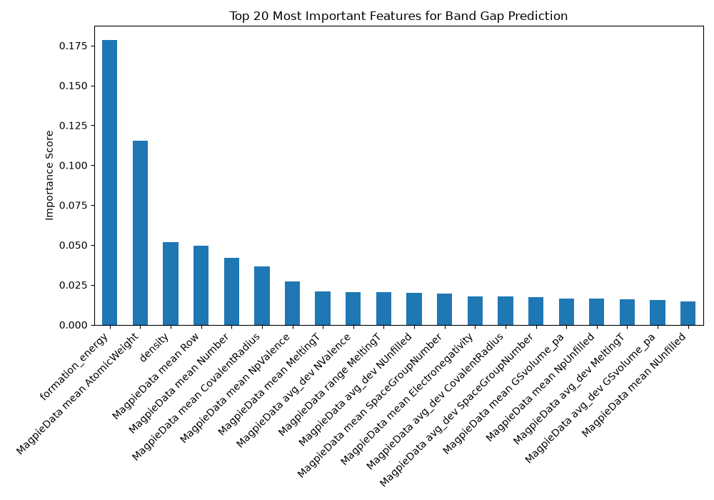

# band-gap-prediction
# Band Gap Prediction Using Machine Learning

## Overview
This project uses machine learning to predict the band gap of iron-oxide materials using data from the Materials Project database. The goal is to classify materials as metals, semiconductors, or insulators without needing lab synthesis — saving significant experimental time and cost.

## What is Band Gap?
Band gap is the energy difference between the valence band and conduction band in a material. It determines whether a material is:
- **Metal** → band gap = 0 eV (conducts electricity freely)
- **Semiconductor** → band gap 0.1–2 eV (used in solar cells, transistors)
- **Insulator** → band gap 4+ eV (does not conduct electricity)

## Dataset
- Source: [Materials Project](https://materialsproject.org/) via mp-api
- System: Iron-Oxide compounds (Fe-O)
- Size: 8,848 materials
- Target property: Band gap (eV)

## Method
1. Fetched materials data using Materials Project API
2. Generated ~130 chemistry-based features using **matminer** (MAGPIE preset)
3. Trained a **Random Forest Regressor** (100 estimators) using scikit-learn
4. Evaluated model performance on 20% held-out test set

## Results
| Model | R² Score | Mean Absolute Error |
|---|---|---|
| Baseline (3 features) | 0.421 | 0.668 eV |
| Matminer features (130 features) | 0.665 | 0.464 eV |

## Key Findings
- **Formation energy** was the most important predictor of band gap (importance score: 0.178)
- **Mean atomic weight** was the second most important feature (0.114)
- Adding chemistry-based features improved R² by **58%** over baseline

## Plots
### Predicted vs Actual Band Gap

### Top 20 Most Important Features

## Tech Stack
- Python 3.12
- mp-api (Materials Project API client)
- matminer (materials featurization)
- scikit-learn (Random Forest)
- pandas (data manipulation)
- matplotlib (visualization)

## How to Run
1. Clone this repository
2. Install dependencies:
pip install mp-api matminer scikit-learn pandas matplotlib
3. Get a free API key from [materialsproject.org](https://materialsproject.org/)
4. Replace `API_KEY` in `model2.py` with your key
5. Run: `python model2.py`

## Author
Materials Science student exploring the intersection of machine learning and materials discovery.
